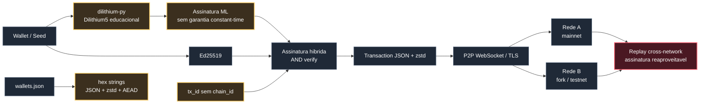
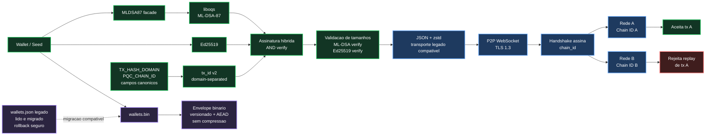

# Blockchain Post-Quantum Chain

PQC-CHAIN é uma prova de conceito de blockchain em Python com assinaturas híbridas pós-quânticas. O projeto usa `ML-DSA-87` via liboqs, combinado com `Ed25519`, e valida transações com regra AND: uma transação só é aceita quando as duas assinaturas verificam sobre o mesmo `tx_id`.

O ambiente recomendado é o Dev Container. Ele compila liboqs de forma reproduzível, instala as dependências Python e evita o uso de implementações educacionais como `dilithium-py`.

## Estado De Segurança

| Área | Implementação atual |
|---|---|
| Assinaturas | `ML-DSA-87` + `Ed25519` com combiner AND |
| ML-DSA | liboqs nativo + `liboqs-python` |
| Replay protection | `PQC_CHAIN_ID` entra no `tx_id` assinado |
| Hash de transação | Domínio `PQC-CHAIN:TX:v2` + `chain_id` + campos canônicos |
| Wallet store | `wallets.bin`, envelope binário versionado, criptografado e sem compressão |
| Wallet legado | `wallets.json` ainda é lido e migrado para `wallets.bin` |
| Armazenamento local | ChaCha20-Poly1305 com chave derivada por HKDF |
| Senhas locais | Argon2id |
| Consenso | Fork-choice por trabalho acumulado, orphan pool e reorg por replay de UTXO |
| P2P | WebSocket sobre TLS 1.3, identidade persistente de nó, ban score e limites de payload |
| Pruning | Configurável por `ARCHIVE_NODE` e `PRUNE_DEPTH` |
| Dev Container | `python:3.11-bookworm`, liboqs `0.15.0`, `liboqs-python==0.15.0` |

Relatórios técnicos:

- [readme-issue.md](readme-issue.md): correções das issues de segurança, modelo de ameaças e runbook.
- [encoding-migration.md](encoding-migration.md): mudança do wallet store e plano seguro para Protobuf.
- [docs/protocol-v2.md](docs/protocol-v2.md): regras normativas do protocolo v2.
- [docs/global-operations.md](docs/global-operations.md): trilha de devnet para testnet pública.
- [docs/release-security.md](docs/release-security.md): gates de supply chain, release e auditoria.
- [docs/home-test.md](docs/home-test.md): passo a passo para rodar em casa, entender domínios e usar bootnodes.
- [docs/bootnode-dns-vps-guide.md](docs/bootnode-dns-vps-guide.md): guia didático para configurar domínio, DNS, VPS e bootnode.
- [docs/complete-testnet-mainnet-runbook.md](docs/complete-testnet-mainnet-runbook.md): runbook completo para testnet, usuários comuns, bootnodes e caminho para mainnet.

## Uso Sem Linha De Comando

No Windows, para a experiência mais simples durante os testes:

```text
run_pqc_node.bat
```

O launcher mostra um menu:

- Public testnet wallet/node: conecta em modo outbound-only, sem abrir porta no roteador.
- Local devnet: roda uma rede local.
- Public bootnode/archive node: modo operador, para VPS/domínio público.

Perfis ficam em `networks/*.yaml`, então usuários comuns não precisam editar código nem exportar variáveis.

## Modelo De Ligações Da Rede

Os diagramas abaixo usam Mermaid para renderizar caixas e ligações no GitHub, em vez de blocos ASCII difíceis de ler.

### Antes Das Correções



### Depois Das Correções



## Por Que Não Protobuf Agora?

Protobuf é uma boa direção para P2P e storage, mas não foi aplicado diretamente no consenso porque isso seria uma migração de protocolo. O formato atual de rede ainda é JSON+zstd para compatibilidade entre nós. O hash de transação usa encoder manual com `struct`, e qualquer migração de consenso precisa de canonicalização, versionamento e vetores de teste.

O que foi aplicado agora é local e compatível: carteiras novas usam `wallets.bin`; carteiras antigas em `wallets.json` continuam legíveis.

## Rodar Com Dev Container

Pré-requisitos:

- Docker Desktop
- VS Code
- Extensão Dev Containers

Passos:

1. Abra a raiz deste repositório no VS Code.
2. Execute `Dev Containers: Rebuild Container Without Cache` na primeira vez após as mudanças de imagem.
3. Aguarde o build. O Dockerfile compila liboqs e instala as dependências.
4. No terminal do container, rode:

```bash
python Quantum.py
```

O primeiro start cria `blockchain_data_<PORT>/config.yaml`, certificados TLS locais, banco RocksDB local e wallet store quando a carteira for criada/importada.

Se o log de build ainda mostrar `mcr.microsoft.com/devcontainers/python:1-3.11-bullseye`, o VS Code está usando configuração antiga ou log antigo. O log correto deve citar `docker.io/library/python:3.11-bookworm`.

## Rodar Um Nó Local

```bash
export PQC_CHAIN_ID="pqc-chain-mainnet-2026-ml-dsa-87-v2"
export PORT=8000
python Quantum.py
```

No PowerShell:

```powershell
$env:PQC_CHAIN_ID="pqc-chain-mainnet-2026-ml-dsa-87-v2"
$env:PORT="8000"
python Quantum.py
```

## Rodar Múltiplos Nós Locais

Use o mesmo `PQC_CHAIN_ID` para nós da mesma rede.

Nó inicial:

```bash
export PQC_CHAIN_ID="pqc-chain-mainnet-2026-ml-dsa-87-v2"
export PORT=8000
python Quantum.py
```

Segundo nó:

```bash
export PQC_CHAIN_ID="pqc-chain-mainnet-2026-ml-dsa-87-v2"
export INITIAL_NODE="127.0.0.1:8000"
export PORT=8001
python Quantum.py
```

Terceiro nó:

```bash
export PQC_CHAIN_ID="pqc-chain-mainnet-2026-ml-dsa-87-v2"
export INITIAL_NODE="127.0.0.1:8000"
export PORT=8002
python Quantum.py
```

Cada nó deve usar `STORAGE_DIR` próprio ou rodar em diretórios separados. Dois nós não devem compartilhar o mesmo `blockchain_data_<PORT>`.

## Rodar Bootnodes Públicos De Testnet

Para nós expostos na internet, configure identidade pública, bootnodes e TLS estrito:

```bash
export PQC_CHAIN_ID="pqc-chain-public-testnet-2026-ml-dsa-87-v2"
export PUBLIC_HOST="node1.example.org"
export BOOTNODES="boot1.example.org:8000,boot2.example.org:8000"
export ARCHIVE_NODE=1
export PRUNE_DEPTH=0
export PQC_STRICT_TLS=1
export PQC_TLS_CA_FILE="/etc/pqc-chain/ca.pem"
python Quantum.py
```

O modo TLS sem verificação continua disponível para devnet local com certificados autoassinados, mas não deve ser usado para redes públicas.

Usuários comuns devem usar modo outbound-only:

```bash
python Quantum.py --network public-testnet --role user --connect-only
```

Esse modo sincroniza a partir de bootnodes sem exigir IP público, port forwarding ou configuração de roteador.

## Testes E Verificações

Dentro do Dev Container:

```bash
python -m py_compile Quantum.py wallet_store.py generate_genesis.py
python tools/verify_requirements_pinned.py
python -m unittest discover -s tests
python tools/verify_vectors.py
python tools/wire_fuzz.py
python -c "import oqs; assert 'ML-DSA-87' in oqs.get_enabled_sig_mechanisms(); print(oqs.oqs_version())"
```

## Arquivos Locais Que Não Devem Ser Commitados

O `.gitignore` bloqueia dados gerados e sensíveis:

- `blockchain_data*/`
- `__pycache__/`
- caches de teste/ferramentas
- ambientes virtuais

`blockchain_data*/` pode conter `wallets.bin`, `wallets.json`, `config.yaml`, `db_key`, certificados e RocksDB. Não publique esses arquivos.

## Replay Protection

Transações v2 incluem `PQC_CHAIN_ID` no `tx_id`. Use identificadores diferentes para redes diferentes:

```bash
export PQC_CHAIN_ID="pqc-chain-mainnet-2026-ml-dsa-87-v2"
export PQC_CHAIN_ID="pqc-chain-testnet-2026-ml-dsa-87-v2"
export PQC_CHAIN_ID="pqc-chain-lab-fork-2026-05-15"
```

Se duas redes usam o mesmo `PQC_CHAIN_ID`, elas estão intencionalmente no mesmo domínio de assinatura.

## Limites Da PoC

Esta é uma PoC técnica, não uma mainnet pronta para custodiar valor real. O projeto não promete proteção contra host comprometido, malware local, engenharia social, supply chain maliciosa ou side-channel absoluto em hardware compartilhado. O modelo de ameaças completo está em [readme-issue.md](readme-issue.md).

## Estrutura Principal

| Caminho | Função |
|---|---|
| `Quantum.py` | Nó, wallet, transações, blocos, P2P e explorer API |
| `wallet_store.py` | Envelope binário versionado para carteiras locais |
| `.devcontainer/` | Build reproduzível com liboqs |
| `networks/` | Perfis de rede, bootnodes e DNS seeds |
| `tests/` | Regressões de segurança e wallet store |
| `test_vectors/` | Vetores imutáveis do protocolo v2 |
| `tools/` | Verificação de vetores e fuzz smoke de wire payload |
| `docs/` | Especificação, operação global e release security |
| `explorer/` | Interface web simples do explorer |
| `readme-issue.md` | Relatório técnico das issues corrigidas |
| `encoding-migration.md` | Decisões sobre wallet encoding e Protobuf |
